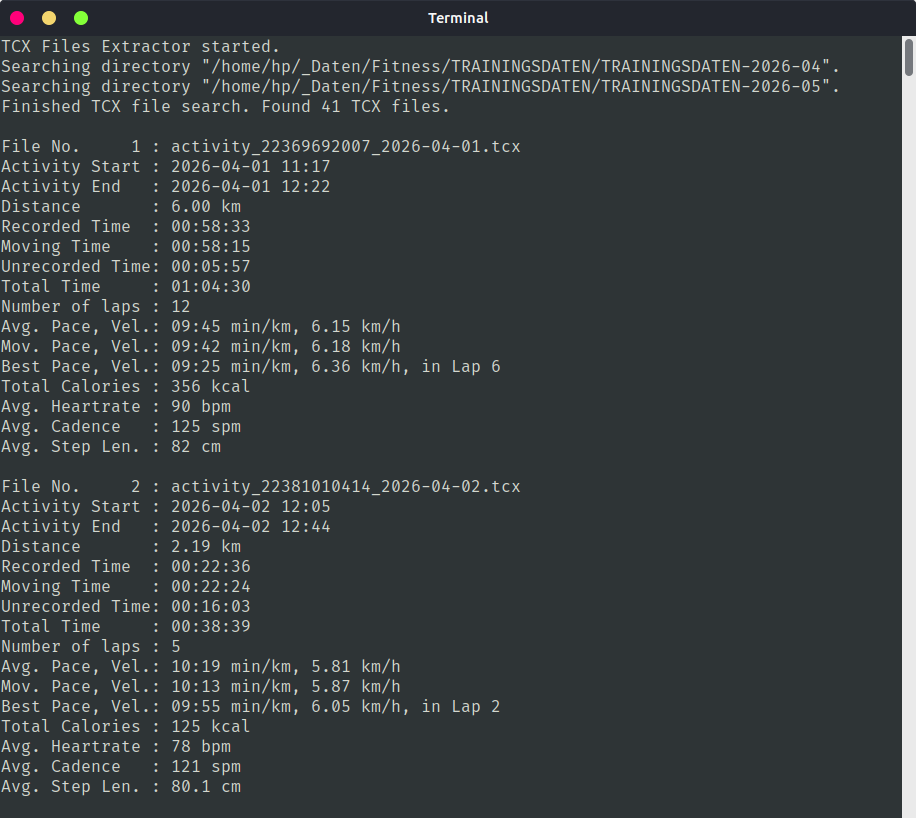

# TCX Files Extractor

 

-----

This console application, programmed in Free Pascal, extracts all essential (walking, running, hiking) activity information from all TCX files in the specified directories. The application processes around 27 TCX files per second on a ThinkPad T14 Gen1 with Intel Core i7-10610U CPU - that's around 1600 files per minute.

Usage:

    ./tcx_files_extractor <directory-1> <directory-2> ... <directory-n>

Screenshot Linux (Walking activities):

-----

### !! Security Notice !! 

The code I released here into the public domain may appear in third-party projects. I do not maintain, endorse, or have any affiliation with such projects. Any malicious or deceptive use is unauthorized and should be reported to the hosting platform. 

-----
